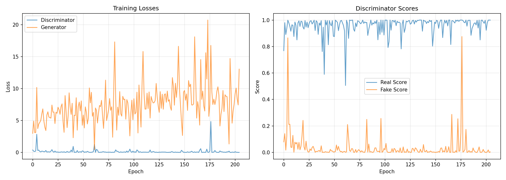

#  Human Faces GAN - Deep Convolutional GAN (DCGAN)

Generate realistic human faces using Deep Convolutional Generative Adversarial Networks trained on the CelebA dataset.  
This project is implemented in **PyTorch** and demonstrates state-of-the-art face synthesis using deep learning.


---

##  Features

-  **AI Face Generation** – Create realistic human faces from random noise vectors
-  **Smart Checkpointing** – Auto-saves progress every 5 minutes
-  **Resume Training** – Continue from where you left off
-  **Multi-Session Training** – Train in multiple short sessions
-  **Training Lock** – Prevents multiple sessions from corrupting data
-  **Real-time Monitoring** – Track losses and scores during training
-  **GPU Optimized** – Efficient training on NVIDIA GPUs
-  **Interactive Menu** – Easy-to-use command-line interface

---

##  Sample Results

<table>
  <tr>
    <td></td>
    <td></td>
    <td align="center">Soon</td>
    <td align="center">Soon</td>
  </tr>
  <tr>
    <td align="center">Epoch 1</td>
    <td align="center">Epoch 50</td>
    <td align="center">Epoch 100</td>
    <td align="center">Epoch 200</td>
  </tr>
</table>

> *AI-generated faces after training on 200,000+ celebrity images from CelebA dataset.*

---

##  Requirements

### Hardware
- **GPU**: NVIDIA GTX 1650 or better (4GB+ VRAM)
- **RAM**: 16GB recommended
- **Storage**: ~2GB for dataset + ~500MB for checkpoints

### Software
- Python 3.8+
- CUDA 11.8+ (for GPU acceleration)
- Windows 10/11 or Linux

---

##  Quick Start

### 1. Clone the Repository
```bash
git clone https://github.com/siby369/human-faces-gan.git
cd human-faces-gan
```

### 2. Install Dependencies
```bash
pip install -r requirements.txt
```

For GPU support (NVIDIA):
```bash
pip install torch torchvision --index-url https://download.pytorch.org/whl/cu118
```

### 3. Download CelebA Dataset
Download the CelebA dataset from Kaggle:

**Dataset URL**: https://www.kaggle.com/datasets/jessicali9530/celeba-dataset

Extract to: `./celeba-dataset/img_align_celeba/`

Your folder structure should look like:
```
human-faces-gan/
├── train_gan.py
├── celeba-dataset/
│   └── img_align_celeba/
│       ├── 000001.jpg
│       ├── 000002.jpg
│       └── ... (202,599 images)
├── checkpoints/
└── generated_faces/
```

### 4. Train the Model
```bash
python train_gan.py
```

Interactive menu:
```
============================================================
TRAINING OPTIONS
============================================================
1. Start NEW training (120 min)
2. RESUME from checkpoint (120 min)
3. GENERATE faces from checkpoint
4. View training progress
============================================================

Enter choice (1-4):
```

### 5. Generate Faces
```bash
python train_gan.py
# Select option 3: Generate faces
# Enter number of faces to generate (e.g., 16, 25, 64)
```

Outputs saved to: `generated_faces/generated_output.png`

---

##  Training Guide

### Training Duration

| Quality Level | Epochs | Time (GTX 1650) | Sessions |
|---------------|--------|-----------------|----------|
| Basic faces | 50-100 | 1.5-2.5 hours | 5-8 |
| Good quality | 100-200 | 2.5-5 hours | 10-15 |
| High quality | 200-300 | 5-7.5 hours | 20-25 |
| Excellent | 300+ | 7.5+ hours | 30+ |

**Typical runtime**: ~6-8 epochs per 10-minute session (GTX 1650)

### Monitoring Training

**Good training indicators:**
- **Real Score**: 0.7-0.9 (Discriminator recognizes real faces)
- **Fake Score**: 0.2-0.4 (Generator fools discriminator sometimes)
- **Generator Loss**: 1.0-3.0 (Stable learning)
- **Discriminator Loss**: 0.5-1.5 (Balanced with generator)

**Example output:**
```
  15.3min | Epoch 45 | L_g: 2.456 | L_d: 0.823 | R: 0.754 | F: 0.234
 Checkpoint saved: checkpoints/checkpoint_latest.pth
  Saved samples: generated_faces/epoch_0045.png
```

---

##  Project Structure

```
human-faces-gan/
├── train_gan.py              # Main training script
├── README.md                 # This file
├── requirements.txt          # Python dependencies
├── LICENSE                   # MIT License
├── .gitignore               # Git ignore rules
│
├── celeba-dataset/          # Dataset directory
│   └── img_align_celeba/    # CelebA images (202,599 files)
│
├── checkpoints/             # Model checkpoints
│   ├── checkpoint_latest.pth    # Most recent checkpoint
│   └── training.lock            # Training lock file
│
└── generated_faces/         # Generated samples
    ├── epoch_0001.png           # Training progress samples
    ├── training_progress.png    # Loss/score graphs
    └── generated_output.png     # Final generation
```

---

##  Configuration

Edit the `Config` class inside `train_gan.py`:

```python
class Config:
    DATA_DIR = './celeba-dataset/img_align_celeba/img_align_celeba'
    CHECKPOINT_DIR = './checkpoints'
    SAMPLE_DIR = './generated_faces'
    
    IMAGE_SIZE = 64              # Output resolution (64x64)
    BATCH_SIZE = 64              # Batch size (reduce if OOM)
    LATENT_SIZE = 128            # Latent vector dimension
    LR = 0.0002                  # Learning rate
    TRAIN_TIME_MINUTES = 120     # Training duration per session
    CHECKPOINT_INTERVAL = 5      # Checkpoint save interval (minutes)
```

### Adjust for Different Hardware

**For 2GB VRAM GPU:**
```python
BATCH_SIZE = 32
IMAGE_SIZE = 64
```

**For 8GB+ VRAM GPU:**
```python
BATCH_SIZE = 128
IMAGE_SIZE = 128  # Higher resolution
```

---

##  Troubleshooting

### CUDA Out of Memory
```python
# Reduce batch size in Config
BATCH_SIZE = 32  # or 16
```

### Training Too Slow
- Check GPU utilization: `nvidia-smi`
- Close other GPU applications
- Reduce `num_workers` in dataloader

### Poor Quality After 100+ Epochs
- Train for minimum 150-200 epochs
- Check discriminator/generator balance
- Adjust learning rate if needed

### Training Lock Error
```bash
# Stop other session or remove lock file
del checkpoints\training.lock  # Windows
rm checkpoints/training.lock   # Linux
```

### Dataset Not Found
```bash
# Verify dataset location
dir celeba-dataset\img_align_celeba  # Windows
ls celeba-dataset/img_align_celeba   # Linux
```

---

##  Model Architecture

### Generator (128D Vector → 64x64 Image)
```
Input: Random noise (128, 1, 1)
↓ ConvTranspose2d (512, 4x4)
↓ ConvTranspose2d (256, 8x8)
↓ ConvTranspose2d (128, 16x16)
↓ ConvTranspose2d (64, 32x32)
↓ ConvTranspose2d (3, 64x64)
Output: RGB Image (3, 64, 64)
```
**Parameters**: ~3.5M

### Discriminator (64x64 Image → Real/Fake)
```
Input: RGB Image (3, 64, 64)
↓ Conv2d (64, 32x32)
↓ Conv2d (128, 16x16)
↓ Conv2d (256, 8x8)
↓ Conv2d (512, 4x4)
↓ Conv2d (1, 1x1)
Output: Probability (0-1)
```
**Parameters**: ~2.8M

---

##  Resources

- [Original GAN Paper (Goodfellow et al., 2014)](https://arxiv.org/abs/1406.2661)
- [DCGAN Paper (Radford et al., 2015)](https://arxiv.org/abs/1511.06434)
- [PyTorch DCGAN Tutorial](https://pytorch.org/tutorials/beginner/dcgan_faces_tutorial.html)
- [CelebA Dataset](https://www.kaggle.com/datasets/jessicali9530/celeba-dataset)

---

##  Contributing

Contributions are welcome!

1. Fork the repository
2. Create your feature branch (`git checkout -b feature/AmazingFeature`)
3. Commit your changes (`git commit -m 'Add AmazingFeature'`)
4. Push to the branch (`git push origin feature/AmazingFeature`)
5. Open a Pull Request

---

##  License

This project is licensed under the MIT License – see the LICENSE file for details.

**What this means:**
-  Commercial use allowed
-  Modification allowed
-  Distribution allowed
-  Private use allowed

---

##  Acknowledgments

- **Dataset**: CelebA Dataset by MMLAB, CUHK
- **Architecture**: DCGAN Paper - Radford et al., 2015
- **Framework**: PyTorch by Meta AI
- **Tutorial**: Deep Learning with PyTorch: Zero to GANs

---

##  Contact

- **Author**: Siby
- **GitHub**: [@siby369](https://github.com/siby369)
- **Project Link**: https://github.com/siby369/human-faces-gan

---

##  Training Evolution

|  |  |  |  |
|:---:|:---:|:---:|:---:|
| **Epoch 1** - Random noise | **Epoch 50** - Face-like shapes | **Epoch 100** - Clear faces | **Epoch 200** - High-quality realistic faces |


*Training metrics - Loss and score progression*

---

##  FAQ

### How long does training take?
- **Minimum viable**: 1-2 hours (50-100 epochs)
- **Good quality**: 3-5 hours (150-200 epochs)
- **Professional**: 6+ hours (300+ epochs)

### Can I train on CPU?
Yes, but 50-100x slower. GPU strongly recommended.

### What GPU do I need?
- **Minimum**: GTX 1650 (4GB VRAM)
- **Recommended**: RTX 3060 (12GB VRAM)
- **Optimal**: RTX 4080+ (16GB+ VRAM)

### Can I use my own dataset?
Yes! Put images in a folder and update `Config.DATA_DIR`. Images are automatically resized to 64x64.

### How do I stop training?
Press `Ctrl + C`. Training will save a checkpoint before stopping.

---

<div align="center">
 If you like this project, give it a star! <br>
Made with  using PyTorch<br>
<a href="https://github.com/siby369/human-faces-gan/issues">Report Bug</a> · <a href="https://github.com/siby369/human-faces-gan/issues">Request Feature</a>
</div>
